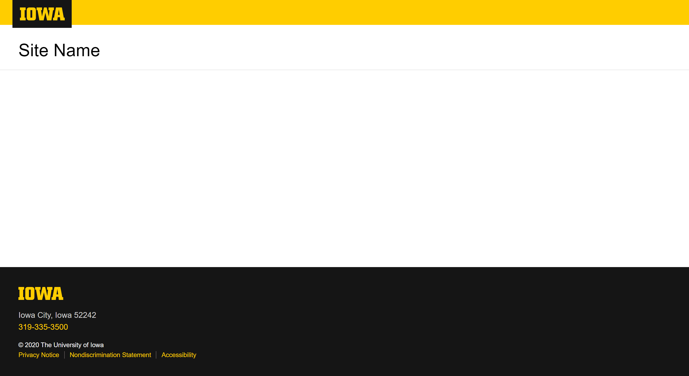

# UIDS Components

A collection of components based on UI Design System ([UIDS](https://uids.brand.uiowa.edu/index.html)).

The CSS in the UIDS website are overly complicated, and many CSS are redundant or conflict with each other. This repository is aimed to simplify the components and CSS by revealing the intents of each piece of HTML and CSS code.

This repository is still a work in progress...

